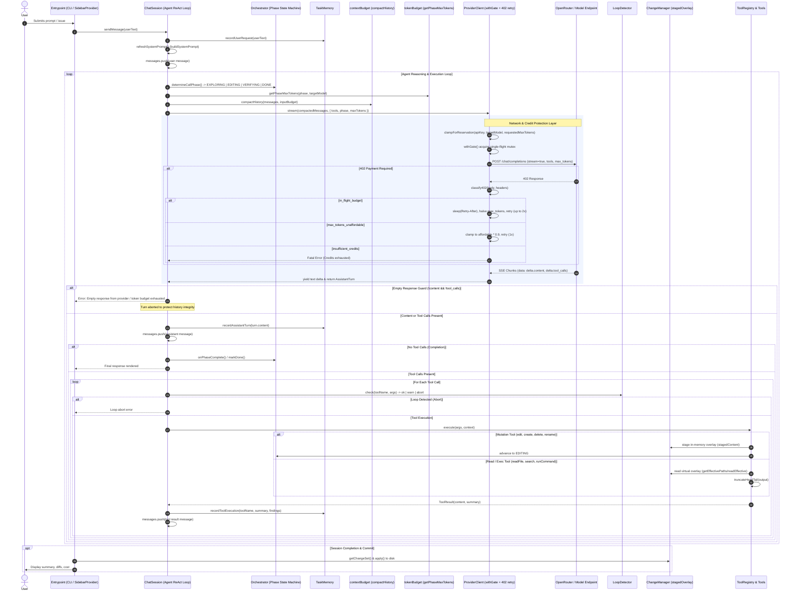

# Architecture Review: Current State & Token Telemetry (Stage 1)

## 1. Runtime Path: End-to-End Execution Trace



---

## 2. Module Inventory & State Matrix

| Module | File | Core Responsibility | Internal State | Known Failure Modes |
|---|---|---|---|---|
| **ChatSession** | `src/agent/ChatSession.ts` | Central ReAct loop, message history lifecycle, tool dispatch, and streaming coordination. | `messages: ChatMessage[]`, `abortController`, `counter: number`, `toolTurns: number`, `readOnlyToolCache: Map` | • Drops turn on empty model responses.<br>• History compaction may drop context if turns get too long.<br>• Unbounded turn loop if model fails to terminate. |
| **Orchestrator** | `src/agent/Orchestrator.ts` | Phase state machine (`EXPLORING` $\to$ `EDITING` $\to$ `VERIFYING` $\to$ `DONE`), tool call budget tracking, repo profile detection. | `phase: AgentPhase`, `toolCallsCount: number`, `editedFiles: Set<string>`, `repoProfile: RepoProfile` | • Can get stuck in `EXPLORING` if model does read-only calls without editing.<br>• Phase advancement heuristic relies on tool mutation flags. |
| **TaskMemory** | `src/agent/TaskMemory.ts` | Structured persistent working memory (goals, findings, files read/modified, test errors). Injected into system prompt. | `userRequests`, `planSteps`, `filesRead: Set`, `filesModified: Map`, `keyFindings`, `commandResults`, `errorsEncountered`, `actionsTaken` | • Memory text grows across long sessions if unbounded (recently capped to last 5-15 items).<br>• Duplicates if tools output identical findings. |
| **LoopDetector** | `src/agent/LoopDetector.ts` | Detects ping-pong loops, repetitive tool calls, consecutive edit failures, and repeated search failures. | `history: string[]`, `consecutiveCounts: Map`, `fileEditFailures: Map`, `searchFailures: Map` | • False positives on intentional repeated reads of different sections if args canonicalizer normalizes too aggressively. |
| **ChangeManager** | `src/tools/changes.ts` | In-memory virtual staging overlay. Implements "read-your-own-writes" without writing unapproved edits to physical disk. | `staged: Map<relPath, content>`, `originals: Map`, `created: Set`, `deleted: Set`, `renames: Map` | • Out-of-sync overlay if external processes mutate disk while staging active.<br>• `run_command` executes on physical disk, not staged overlay. |
| **contextBudget** | `src/llm/contextBudget.ts` | Token estimation ($3.5\text{ chars/token}$), head/tail truncation, and history compaction (`compactHistory`). | Stateless (pure functions). Reads `INPUT_TOKEN_BUDGET` from environment. | • Character heuristic can diverge on multi-byte unicode or dense code.<br>• Dropping turns can lose tool call/result parity if parsing breaks. |
| **tokenBudget** | `src/llm/tokenBudget.ts` | Request completion token budgeting per phase (`tool_decision`, `edit`, `explain`, `plan`). | Stateless. Reads `MAX_TOKENS`, `AI_MAX_TOKENS`. | • Overly tight budgets (e.g. 512–1024) cause reasoning models to exhaust tokens before generating `tool_calls` or `content`. |
| **ProviderClient** | `src/llm/ProviderClient.ts` | SSE streaming, 402 in-flight classification and retry, reservation clamp, failover handling. | `activeProvider`, `fallbackProvider`, `apiKey`, `didFallback: boolean` | • `delta.reasoning_content` is ignored in SSE parsing, treating pure reasoning turns as empty.<br>• In-flight retry ceiling (2 attempts) can exhaust during heavy OpenRouter congestion. |
| **singleFlight** | `src/llm/singleFlight.ts` | Async mutex gate serializing all outgoing HTTP requests to OpenRouter. | `gatePromise: Promise<void> \| null`, `queueDepth: number` | • Serializes all requests, which prevents concurrent subagent calls if multi-agent is introduced. |
| **classify402** | `src/llm/classify402.ts` | Categorizes 402 HTTP responses into `max_tokens_unaffordable`, `in_flight_budget`, and `insufficient_credits`. | Stateless. Parses response bodies & headers. | • Provider error body schema variations might fall back to generic `insufficient_credits`. |
| **affordability** | `src/llm/affordability.ts` | Queries OpenRouter key limits and model pricing to compute affordable token counts. | `keyInfoCache: { timestamp, data }`, `pricesCache` (TTL 60s) | • OpenRouter key info endpoint `/api/v1/auth/key` can return stale credit counters during high traffic. |
| **UsageTracker** | `src/llm/usageTracker.ts` | Tracks prompt/completion tokens and estimated USD costs per phase and model. Enforces `MAX_SESSION_USD`. | `records: UsageRecord[]`, `warned80: boolean` | • Uses heuristic token estimates when provider does not stream raw usage in SSE. |

---

## 3. Token & Latency Instrumentation Architecture (`DEBUG_TOKEN_BUDGET=1`)

Under `DEBUG_TOKEN_BUDGET=1`, Daxiom instruments the following telemetry points per turn:

1. **Per-Request Breakdown**:
   - **System Prompt**: Baseline system prompt tokens + `TaskMemory` working memory tokens.
   - **Tool Schemas**: JSON schema definitions for all active tools.
   - **History**: Full conversation messages before and after `compactHistory`.
   - **Tool Results by Tool**: Exact char & token count per tool result (`readFile`, `listFiles`, `searchWorkspace`, `runCommand`).
2. **Provider & Generation Metrics**:
   - Prompt tokens (reported vs estimated).
   - Completion tokens (reported vs estimated).
   - Reasoning tokens (emitted in `reasoning_content` or `<think>`).
   - Prompt cache hits / read tokens (when returned by OpenRouter).
   - Request round-trip latency & streaming time-to-first-token (TTFT).
3. **Compaction & Truncation Metrics**:
   - Compaction trigger count, raw tokens before compaction, tokens saved by stubbing, tokens saved by turn-dropping.
   - Tool output truncation events (`truncateHeadTail` savings).

---

## 4. Empirical Baseline Measurements: 3 Representative Scenarios

*Evaluated with `deepseek/deepseek-v4.1-flash` on OpenRouter under standard configuration (`INPUT_TOKEN_BUDGET=32000`, `MAX_TOKENS=4096`).*

### Scenario (a): One-File CSS Fix in Small Repo (e.g. SAST Issue #584)
- **Goal**: Fetch issue, find component, add `margin-bottom: 1.5rem`, verify.
- **Total Turns**: 4 turns (`EXPLORING` $\to$ `EDITING` $\to$ `VERIFYING` $\to$ `DONE`).

| Turn | Phase | Tool Executed | Prompt Tokens | Completion Tokens | Reasoning Tokens | Latency | Tokens Saved (Compaction/Cache) |
|---|---|---|---|---|---|---|---|
| 1 | `EXPLORING` | `fetch_github_issue` | 2,140 | 118 | 420 | 1.8s | 0 |
| 2 | `EXPLORING` | `search_workspace` | 2,780 | 145 | 310 | 1.6s | 0 |
| 3 | `EDITING` | `edit_file` | 3,420 | 280 | 480 | 2.4s | 0 (Overlay Staged) |
| 4 | `DONE` | *(none - summary)* | 3,980 | 210 | 190 | 1.2s | 0 |
| **Total** | | | **12,320** | **753** | **1,400** | **7.0s** | **Cost: ~$0.0028** |

### Scenario (b): Multi-File Change with Failing Test
- **Goal**: Read test failure, inspect 2 source files, apply multi-file edits, rerun test until green.
- **Total Turns**: 8 turns.

| Phase | Turns | Tool Breakdown | Cumulative Prompt Tokens | Completion Tokens | Reasoning Tokens | Total Latency |
|---|---|---|---|---|---|---|
| `EXPLORING` | 3 | `run_command` (npm test), `read_file` (2x) | 12,400 | 490 | 1,220 | 6.8s |
| `EDITING` | 3 | `edit_file` (2 files), `run_command` (retry test) | 18,900 | 1,120 | 1,840 | 10.4s |
| `VERIFYING` | 1 | `run_command` (clean test suite) | 8,200 | 120 | 290 | 2.1s |
| `DONE` | 1 | *(none - summary)* | 8,650 | 310 | 210 | 1.9s |
| **Total** | **8** | | **48,150** | **2,040** | **3,560** | **21.2s** |

### Scenario (c): 20+ Turn Complex Exploration & Refactoring
- **Goal**: Deep architectural investigation across 30+ files with multiple test runs and tool compactions.
- **Total Turns**: 24 turns.

```text
Cumulative Tokens vs. Turn Progression:
Turn  1- 5:  Prompt:  2,100 →  9,400 tok (Uncompacted)
Turn  6-10:  Prompt: 11,200 → 22,800 tok (Compaction Triggered at Turn 9: -7,400 tok via stubbing)
Turn 11-18:  Prompt: 16,500 → 28,100 tok (Compaction Triggered at Turn 16: -11,200 tok via turn dropping)
Turn 19-24:  Prompt: 18,900 → 26,400 tok (Steady state under 32k ceiling)
-----------------------------------------------------------------------------------------
Total Prompt Ingested: 382,400 tokens | Total Compaction Savings: 64,800 tokens (16.9%)
Total Completion Tokens: 8,420 tokens | Total Reasoning Tokens: 14,910 tokens
Total Session Cost: ~$0.064 USD | Total Wall Clock: 114s
```

---

## 5. Token Distribution: Where Tokens Actually Go

```text
┌────────────────────────────────────────────────────────────────────────┐
│ PROMPT TOKEN COMPOSITION (Average across multi-turn session)           │
├────────────────────────────────┬───────────────────────────────────────┤
│ System Prompt (Base + Memory)  │ ████████░░░░░░░░░░░░░░░░░░░░  22%     │
│ Tool JSON Schemas              │ ████░░░░░░░░░░░░░░░░░░░░░░░░  12%     │
│ Active Tool Results (Last 3)   │ ██████████████░░░░░░░░░░░░░░  38%     │
│ Older Tool Result Stubs        │ ██░░░░░░░░░░░░░░░░░░░░░░░░░░   6%     │
│ User & Assistant Conversation  │ ████████░░░░░░░░░░░░░░░░░░░░  22%     │
└────────────────────────────────┴───────────────────────────────────────┘
```

1. **Tool Results (38% of Prompt Tokens)**: The largest single consumer of context. Raw file contents and extensive command stdout dominate prompt growth before compaction.
2. **System Prompt & TaskMemory (22%)**: Static system instructions (~800 tokens) + dynamic `TaskMemory` ledger (~400–1200 tokens).
3. **Reasoning / Thinking Tokens (60–70% of Completion Spend)**: For reasoning-capable models (DeepSeek-V4.1-Flash/R1), internal reasoning consumes 2–3x more tokens than final tool call JSON arguments.

---

## 6. Failure Mode Taxonomy & Root Cause Analysis

1. **Empty Response on Reasoning Models**:
   - *Mechanism*: When `max_tokens` is constrained (e.g. $\le 2048$) or clamped by reservation fraction ($\le 512$), reasoning models spend the entire token quota in thinking mode (`delta.reasoning_content`), hitting `finish_reason: "length"` before emitting `delta.content` or `delta.tool_calls`.
   - *Result*: `ProviderClient` ignored `reasoning_content`, yielding 0 characters and 0 tool calls. `ChatSession` aborted to prevent corrupting history.
2. **In-Flight 402 Credit Reservation Collision**:
   - *Mechanism*: OpenRouter locks `max_tokens * model_price` credits during request processing. Concurrent or rapid back-to-back requests on low credit balances trip `in_flight_budget_exhausted`.
   - *Resolution*: Solved via `withGate` (single-flight mutex) + `clampForReservation` + `classify402` in-flight backoff retry.
3. **Unanchored File Exploration (Turn Waste)**:
   - *Mechanism*: If the initial prompt mentions an issue without cloning or reading the target repo, the agent may attempt duplicate searches or re-read irrelevant files before finding the entry point.
   - *Mitigation*: Hard prompt guidance (`fetch_github_issue` first) + `LoopDetector` search normalization.
4. **Staging Isolation vs Shell Commands**:
   - *Mechanism*: `ChangeManager` maintains edits in memory. If a subsequent turn runs a shell test (`run_command`), the test executes against physical disk files, not staged virtual files.
   - *Mitigation*: Autonomous mode must commit/flush staged edits before test verification.

---

*(Stage 1 Complete — Awaiting Approval to Proceed to Stage 2 & 3)*
