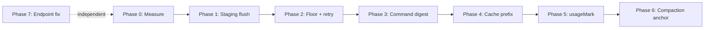

# Architecture Review: Ranked Change Design & Migration Plan (Stage 3, revised)

Supersedes `03-design.md`. Same goals, but corrected for the review findings: prompt-cache placement, staging-flush safety, floor vs. phase budget, phase/module limits, and no invented numbers.

## 0. Ground rules (apply to every change)

1. **Every change is behind a flag that defaults to OFF.** A flag flips to default ON in a separate commit, only after its gate passes. Rollback = unset the flag.
2. **Fail open.** Any new code path that errors falls back to the exact old behaviour and logs under `DEBUG_TOKEN_BUDGET=1`.
3. **At most two existing modules per phase.** A new pure helper file (no imports from the rest of the harness) counts as part of the module that uses it.
4. **No behaviour change without a measurement before and after.**
5. **Numbers are labelled**: *measured* (Stage 1/2 baseline), *target* (a goal, not a prediction), or *unmeasured*.

Baseline values (measured in Stage 1/2): tool results = 38% of prompt tokens; reasoning = 60-70% of completion spend; compaction saved ~17% (64,800 saved vs 382,400 ingested, scenario c); prompt cache hits = 0; 3.5 chars/token heuristic drifted 12-18%; scenario (a) cost $0.0028; scenario (c) cost $0.064; scenario (b) tool-result tokens ~18,000 (of which ~12,400 raw test output).

## 1. Ranked changes

Order changed from v1: correctness first, then reliability (floor + retry merged), then the biggest token lever, then cache, then accounting, then compaction.

### Change 1: Staged overlay materialization for verification commands
- **Problem**: `run_command` tests run against disk while edits exist only in the overlay, so tests verify stale files (correctness bug).
- **Solution** (`changes.ts`, hook in `runCommand.ts`): add `ChangeManager.withMaterialized(fn)`:
  1. Runs only for commands classified as verification (test/build/lint/typecheck, e.g. `npm test`, `npm run build`, `tsc`, `jest`, `vitest`, `pytest`, `cargo test`, `go test`). Skipped entirely if the overlay is empty (zero overhead for unrelated commands).
  2. Writes a **journal** (`.daxiom/journal/<id>.json`) holding the original content (or "did not exist"), mode, and the content we are about to write, for each affected file.
  3. Applies staged edits, creations, deletions and renames (rename = delete + create) to disk, runs the command, and waits for the child process to fully exit (including on timeout/kill).
  4. Restores in a `finally` block: originals back, created files removed, deleted files recreated, mode preserved. Then deletes the journal.
  5. **Conflict rule**: if a file's disk content after the command differs from what we wrote (the command modified it), do not overwrite it; keep a backup in the journal directory and warn.
  6. **Crash recovery**: on first `ChangeManager` use, if a stale journal exists, restore from it before doing anything else (stays inside `changes.ts`, so `ChatSession` is untouched).
  7. Serialized with a mutex so overlapping commands cannot interleave materialization.
  8. The tool result notes "ran against staged edits" so the model knows what was tested.
- **Rejected alternative**: running in a temp copy of the workspace. Needs `node_modules` and path handling; too heavy and more likely to break.
- **Flag**: `DAXIOM_STAGED_DISK_SYNC` (default OFF until gate)
- **Complexity**: Medium (~100-150 LOC plus tests), because restore correctness matters more than the write.
- **Success metric**: 0 verification runs against stale disk; after every run (including forced failure/kill), the working tree is byte-identical to before the run. (Test pass rate is *not* the metric: it depends on whether the fix is right.)
- **Risk**: unapproved edits left on disk if restore fails. Mitigated by the journal, the `finally` block, and crash recovery. This is the highest-risk change and gets the strictest tests.

### Change 2: Reasoning-safe output floor + single escalating retry (merges old 2 and 7)
- **Problem**: reasoning models spend 1,400+ tokens (scenario a) before a ~118-token tool call. When `max_tokens` is clamped low, the reply truncates with `finish_reason: "length"` and returns no content and no tool calls, ending the session.
- **Solution** (`tokenBudget.ts`, `ChatSession.ts`):
  1. **Floor** for `tool_decision` and `edit` phases: `max_tokens = max(phaseBudget, floor)` but never above what `affordability` says is safe. If the floor is **not affordable**, do not send a request that will truncate; surface the existing affordability/402 message instead.
  2. **One retry** when a turn returns no content and no tool calls: if `finish_reason` is `length`, retry once with a larger `max_tokens` (about 2x, capped by affordability and a hard ceiling); otherwise retry once with a nudge. The nudge is added to the request only and is **never saved to history**.
  3. After one failed retry, fail with a clear message (no loops).
- **Floor value**: 2,560 is a **starting estimate** (observed 1,400 + 118, plus margin). Calibrate in Phase 0 from the p95 of reasoning + output tokens observed across baseline runs, and note that the current `tool_decision` budget (2,048) is below this value.
- **Flags**: `DAXIOM_MIN_REASONING_FLOOR` (0 = off, default), `DAXIOM_EMPTY_TURN_RETRY` (default OFF)
- **Complexity**: Low-Medium (~70 LOC)
- **Success metric**: 0 empty-response terminations in a replayed set of the failing scenario-(a) conditions, and no new 402s attributable to the floor.
- **Risk**: higher per-request reservation on low balances; mitigated by affordability check and the `singleFlight` gate.

### Change 3: Command output digest with full-output scratch file
- **Problem**: tool results are 38% of prompt tokens; scenario (b) ingests ~12,400 tokens of raw test output.
- **Precondition (from Phase 0)**: confirm what share of the 38% is `run_command`. If most of it is `read_file`/`grep`, this change only helps scenario (b), and the next lever would be tighter read/search results instead.
- **Solution** (`runCommand.ts` + new pure helper `commandDigest.ts`):
  1. Always write full output to `.daxiom/scratch/cmd-<id>.log` (size-capped; keep last N, clean up on session end; `.daxiom/` in `.gitignore`).
  2. Parse known formats (jest/vitest, tsc, eslint, pytest, generic): exit code, failing test names, assertion diffs, top few stack lines, scratch path.
  3. **If the format is not recognized, fall back to today's `truncateHeadTail` behaviour** (plus the scratch path). Successful short output is left untouched.
  4. Make sure `read_file` can open the scratch path so the model can fetch details.
- **Flag**: `DAXIOM_COMMAND_DIGEST` (default OFF until gate)
- **Complexity**: Medium (~120 LOC plus parser fixtures)
- **Success metric**: scenario (b) tool-result prompt tokens fall from ~18,000 (measured); **target** roughly 70% reduction, with the fixed scenario still reaching the same final result.
- **Risk**: a digest omits the one line the model needed. Mitigated by the fallback and the always-present raw-log path.

### Change 4: Cache-stable prompt prefix
- **Problem**: 0 cache hits measured. Working memory is injected into the system prompt and changes it every turn.
- **Step 4a (audit only)**: under `DEBUG_TOKEN_BUDGET=1`, hash the system prompt and the serialized tool schemas each turn and log whether they are byte-identical (`isPrefixStable`); log `cached_tokens` if the provider reports it. Remove any time-varying or non-deterministic content (dates, unordered keys) from the prefix.
- **Step 4b (change)** (`ChatSession.ts`, `TaskMemory.ts`): keep system prompt + tool schemas immutable and move dynamic working memory **to the tail of the request** as an ephemeral message that is rendered per request and **not stored in history**. This keeps the prefix *and* the append-only history cacheable. (v1 placed it directly after the system prompt, which would have invalidated the cache for all history behind it.)
- **Provider handling**: DeepSeek-family models cache prefixes automatically, so no `cache_control` is added. For Anthropic-family model ids only, add `cache_control` to the stable prefix. Any provider error falls back to the current single-prompt behaviour.
- **Flag**: `DAXIOM_STABLE_CACHE_PREFIX` (default OFF until gate)
- **Complexity**: Medium (~90 LOC)
- **Success metric**: `cached_tokens > 0` on turn 2+ (measured from provider usage). No percentage target until Phase 0/4a shows what the provider reports; the 34% prefix share in Stage 2 is only valid for short runs (about 12% of an average scenario-c turn).
- **Risk**: some models handle a trailing context message differently; verify scenario outcomes are unchanged.

### Change 5: `usageMark` hybrid token estimation
- **Problem**: chars/3.5 drifted 12-18% from real counts, which mis-times compaction.
- **Solution** (`contextBudget.ts`, `usageTracker.ts`): store the provider's real `prompt_tokens` and the message count it covered; estimate only messages added afterwards. **Reset the mark whenever history is rewritten** (compaction, anchor insertion), because the stored count no longer matches. If usage is missing from the stream, fall back to the pure heuristic.
- **Flag**: `DAXIOM_USAGEMARK_ESTIMATION` (default OFF until gate)
- **Complexity**: Medium (~80 LOC)
- **Success metric**: mean absolute error of the estimate vs. the next real `prompt_tokens`, logged per turn. **Target** <= 5% on 20+ turn runs (v1's 2% was unmeasured).
- **Risk**: stale mark after any history mutation; covered by the reset rule and a unit test.

### Change 6: Compaction with a TaskMemory anchor
- **Problem**: in scenario (c), dropping old turns made the agent re-explore files it had already seen.
- **Solution** (`contextBudget.ts`, `TaskMemory.ts`): when compaction drops turns, insert **one** anchor message (goal, current plan step, files touched, key findings) directly after the system prompt, capped at ~400 tokens, replacing any previous anchor. Compaction stays a single big event (not per-turn rewriting), so the prefix stays stable between events. Thresholds stay as they are now (already absolute budgets); revisit only with data.
- **Flag**: `DAXIOM_COMPACT_MEMORY_ANCHOR` (default OFF until gate)
- **Complexity**: Low-Medium (~50-70 LOC)
- **Success metric**: re-exploration turns in scenario (c) after a compaction event, from a measured baseline of 6; **target** <= 1.
- **Risk**: anchor bloat; cap enforced.

### Change 7: OpenRouter key endpoint fix (chore)
- **Problem**: `affordability.ts` references `/api/v1/auth/key`; the correct endpoint is `/api/v1/key`.
- **Solution** (`affordability.ts`): use `/api/v1/key`, fall back to the old path on 404, and fix the comment/docs.
- **Flag**: `DAXIOM_KEY_ENDPOINT_FIX` (default OFF until verified against a real key)
- **Complexity**: Low (~10 LOC)
- **Success metric**: HTTP 200 on key-info checks, no 404/400.
- **Risk**: negligible; independent of the other phases and can ship any time.

### Kept as-is (no change)
- Reasoning content is not replayed in history. Stage 2 estimates ~180,000 extra prompt tokens for scenario (c) if it were (an estimate, not a measurement).
- Daxiom's size-plus-re-read-hint stub, the ~6,000-char tool cap, ChangeManager rollback, LoopDetector, and the Orchestrator.

### Deferred
Subagents, fallback tournament, shadow-git checkpoints, importance scoring, 70%/35% percentage thresholds, extra stall detection, auto-test on finish.

## 2. Phased migration plan

Every phase: compile (`tsc`), full `npm test` (currently 202 passing) plus the new unit tests, replay the baseline scenarios, check the metric, and only then start the next phase. Flag stays OFF in the commit that adds code; a later commit flips the default.

| Phase | Modules (max 2) | What | Gate |
|---|---|---|---|
| 0 | `usageTracker.ts` (logging only) | Add per-tool token breakdown, log `cached_tokens` and reasoning tokens per turn, record p95 reasoning+output. Resolve the 2,048 vs 512 clamp discrepancy. No behaviour change. | Report answers: share of the 38% by tool; does the provider report cached tokens; the calibrated floor value. |
| 1 | `changes.ts`, `runCommand.ts` | Change 1 | Unit tests: edit/create/delete/rename, exception and timeout during the command, simulated crash + recovery, command modifies a staged file. Tree byte-identical after every run. Scenario (b) verifies staged edits on the first run. |
| 2 | `tokenBudget.ts`, `ChatSession.ts` | Change 2 | Replay of the scenario-(a) failing conditions yields 0 empty terminations; affordability path still returns a clear error when the floor is unaffordable. |
| 3 | `runCommand.ts` (+ `commandDigest.ts`) | Change 3, only if Phase 0 shows `run_command` is a meaningful share | Scenario (b) tool-result tokens drop vs. the ~18,000 baseline; same final outcome; unknown formats fall back cleanly. |
| 4 | `ChatSession.ts`, `TaskMemory.ts` | 4a audit first, then 4b | 4a: prefix byte-identical each turn. 4b: `cached_tokens > 0` from turn 2; scenario outcomes unchanged. |
| 5 | `contextBudget.ts`, `usageTracker.ts` | Change 5 | Logged estimate error <= 5% over a 20+ turn run; mark resets after compaction. |
| 6 | `contextBudget.ts`, `TaskMemory.ts` | Change 6 | Scenario (c): re-exploration turns <= 1 after compaction; anchor <= ~400 tokens. |
| 7 | `affordability.ts` | Change 7 | 200 from the real endpoint; fallback works on 404. |

## 3. Benchmark plan (no invented numbers)

- **Deterministic replay**: a mock provider replaying recorded tool outputs for token/byte counts (no model noise).
- **Real-model runs**: 3 runs per scenario on the cheap model; report median and range for cost and turns.
- **Scenarios**: (a) one-file CSS fix, (b) multi-file change with a failing test, (c) 24-turn exploration.
- **Recorded per run**: prompt/completion/reasoning/cached tokens, tool-result tokens by tool, compaction events, retries, final outcome (did the task succeed).
- **Rule**: a change that lowers cost but lowers success rate does not pass its gate. The 24-turn cost target ($0.045 in v1) is dropped; report the measured cost after each phase instead.

## 4. Top risks

1. **Change 1** could leave unapproved edits on disk if restore fails. Strictest testing, journal + `finally` + crash recovery.
2. **Change 2**'s floor could cause budget failures on low balances. Never exceed the affordable amount; fail clearly instead.
3. **Change 4** could hurt caching or model behaviour if dynamic memory is placed early. Memory goes at the tail; 4a audit comes first.
