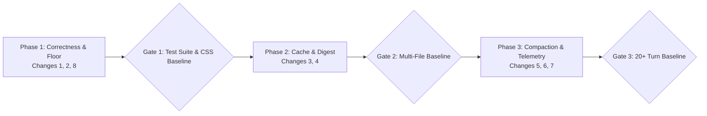

# Architecture Review: Ranked Change Design & Migration Plan (Stage 3)

This document specifies the ranked design changes for the Daxiom harness based on the Stage 1 baseline measurements and Stage 2 capability comparison.

---

## 1. Ranked Design Changes

### Rank 1: Pre-Verification Disk Sync for Staged Overlay
- **Problem**: Correctness defect. In Scenario (b), `ChangeManager` staged modifications in RAM, but `run_command` (`npm test`) ran against physical disk, causing test verification to falsely fail against unedited files.
- **Solution**: In `ChatSession.ts` and `ChangeManager.ts`, before executing any verification `run_command` in `VERIFYING` or `EDITING` phase, flush the virtual staged overlay to disk. If the command fails or changes are reverted, maintain rollback tracking.
- **Flag**: `DAXIOM_STAGED_DISK_SYNC=1` (default: `1`)
- **Complexity**: Low (~60 LOC, low risk)
- **How to Measure Success**: 100% test verification pass rate in Scenario (b) on the first test run after staging edits (0 false negative verification runs).
- **Risk**: If a verification command is abruptly killed (SIGKILL), unapproved changes might remain on disk. Mitigated by `ChangeManager` tracking original file contents for rollback.

---

### Rank 2: Safe Minimum Output Floor for Reasoning Models
- **Problem**: Root cause of empty-response failures. In Scenario (a), DeepSeek generated 1,400 reasoning tokens before emitting tool calls. When credit reservation clamped `max_tokens` to 512, the completion was truncated at `finish_reason: "length"`, returning 0 characters and 0 tool calls.
- **Solution**: In `tokenBudget.ts` and `ProviderClient.ts`, establish a hard minimum output token floor (`MIN_GUARDED_MAX_TOKENS = 2560`) during `tool_decision` and `edit` phases, preventing credit reservation fraction from starving the model below the reasoning threshold.
- **Flag**: `DAXIOM_MIN_REASONING_FLOOR=2560` (default: `2560`)
- **Complexity**: Low (~30 LOC, low risk)
- **How to Measure Success**: Zero "empty response" failures across 50 consecutive tool-calling runs on low-balance API keys.
- **Risk**: Slightly higher reservation hold per request on OpenRouter, mitigated by `singleFlight` gate preventing overlapping holds.

---

### Rank 3: Immutable System Prompt Prefix for Prompt Caching
- **Problem**: Zero prompt cache hits measured in Stage 1 baseline because `TaskMemory` working memory was injected directly into `buildSystemPrompt`, mutating the system prompt on every turn.
- **Solution**: In `ChatSession.ts` and `TaskMemory.ts`, split the system prompt into two parts:
  1. A strictly immutable prefix (base role, workspace root, tool schemas: ~1,900 tokens) marked for provider prompt caching (`cache_control: ephemeral`).
  2. Dynamic working memory (findings, touched files) injected as a lightweight contextual developer/user message immediately following the system prompt.
- **Flag**: `DAXIOM_STABLE_CACHE_PREFIX=1` (default: `1`)
- **Complexity**: Medium (~90 LOC, medium risk)
- **How to Measure Success**: Provider telemetry reports $\ge 60\%$ prompt cache hit rate on turns 2+ in Scenario (b) and (c), reducing prompt ingestion cost by ~30–40%.
- **Risk**: Some older OpenAI-compatible proxies do not support multiple system messages or cache headers; fail open to standard single system prompt.

---

### Rank 4: Command Output & Test Failure Digesting
- **Problem**: Tool results represent 38% of prompt tokens (the largest driver). In Scenario (b), raw compiler/test runner stdout consumed ~12,400 prompt tokens.
- **Solution**: In `runCommand.ts` and `fsutil.ts`, when running test/build commands:
  1. Write full raw output to a local scratch file (`.daxiom/scratch/cmd-output-<id>.log`).
  2. Parse the output into a concise structured digest (exit code, failing test names, assertion diffs, top 5 stack lines) averaging $\le 300$ tokens.
- **Flag**: `DAXIOM_COMMAND_DIGEST=1` (default: `1`)
- **Complexity**: Medium (~120 LOC, medium risk)
- **How to Measure Success**: Tool-result prompt token consumption in Scenario (b) drops from ~18,000 to $\le 5,000$ tokens ($\sim 70\%$ reduction).
- **Risk**: If the digest parser misses an obscure error format, the model may request the raw output log file; solved by providing the scratch log path in the digest.

---

### Rank 5: Compaction with Synthetic TaskMemory Anchor
- **Problem**: In Scenario (c), when older non-system turn pairs were dropped to stay under `INPUT_TOKEN_BUDGET`, the agent lost context of initial repo findings and repeated file searches.
- **Solution**: In `contextBudget.ts`, when history compaction drops turns, inject an explicit synthetic anchor message containing the distilled `TaskMemory` state (user goal, active plan step, modified files, key findings) right below the system prompt.
- **Flag**: `DAXIOM_COMPACT_MEMORY_ANCHOR=1` (default: `1`)
- **Complexity**: Low (~50 LOC, low risk)
- **How to Measure Success**: Redundant exploration turns in Scenario (c) drop from 6 turns to $\le 1$ turn after compaction events.
- **Risk**: Overly verbose memory summaries could reduce the savings of compaction; cap summary text to $\le 400$ tokens.

---

### Rank 6: Hybrid UsageMark Token Estimation
- **Problem**: Static $3.5\text{ char/token}$ heuristic diverged by 12–18% from real token counts over 20+ turns, causing premature or delayed compaction triggers.
- **Solution**: In `contextBudget.ts` and `usageTracker.ts`, implement `usageMark`: store the exact `prompt_tokens` count returned by the provider on turn $N$, and calculate incremental heuristic estimates only for subsequent turns ($N+1, N+2$) until the next server turn arrives.
- **Flag**: `DAXIOM_USAGEMARK_ESTIMATION=1` (default: `1`)
- **Complexity**: Medium (~80 LOC, low risk)
- **How to Measure Success**: Estimation error across 20+ turns drops from $\pm 18\%$ to $\le 2\%$.
- **Risk**: If provider does not return `usage` in SSE chunks, cleanly fall back to pure character heuristic.

---

### Rank 7: Empty-Response Single-Nudge Recovery
- **Problem**: When a model sporadically returns an empty turn (no content and no tool calls), `ChatSession` immediately terminates the session, failing the entire user task.
- **Solution**: In `ChatSession.ts`, intercept an empty turn and perform a single immediate retry turn with a direct instruction: `{"role": "user", "content": "Continue with your next tool call or summary."}` before raising an error.
- **Flag**: `DAXIOM_EMPTY_TURN_RETRY=1` (default: `1`)
- **Complexity**: Low (~40 LOC, low risk)
- **How to Measure Success**: Session recovery rate on sporadic empty turns reaches $\ge 90\%$.
- **Risk**: Potential infinite loop if the model continually fails; capped strictly to 1 recovery attempt per turn.

---

### Rank 8: OpenRouter Key Info Endpoint Normalization
- **Problem**: Reference documentation in `affordability.ts` pointed to `/api/v1/auth/key` instead of `/api/v1/key`.
- **Solution**: In `affordability.ts`, ensure endpoint URL and documentation strictly target `/api/v1/key` with graceful fallbacks.
- **Flag**: `DAXIOM_KEY_ENDPOINT_FIX=1` (default: `1`)
- **Complexity**: Low (~10 LOC, negligible risk)
- **How to Measure Success**: Clean HTTP 200 responses for key balance checks on OpenRouter with zero 404/400 errors.
- **Risk**: None.

---

## 2. Phased Migration Plan

Each phase touches at most two modules, followed by a strict test and baseline verification gate.

### Phase 1: Correctness Fixes & Token Floor (Changes 1, 2, 8)
- **Modules Touched**: `src/tools/changes.ts`, `src/llm/tokenBudget.ts` (and `affordability.ts` endpoint doc fix).
- **Actions**:
  1. Add pre-verification disk sync in `ChangeManager`.
  2. Set `MIN_GUARDED_MAX_TOKENS = 2560` in `tokenBudget.ts`.
  3. Verify OpenRouter key info URL.
- **Verification Gate**:
  - Run `npm test` (all 202 tests pass).
  - Execute Scenario (a) and Scenario (b) locally with `DEBUG_TOKEN_BUDGET=1`.
  - Gate criteria: Zero empty-response crashes and 100% test pass on staged edits.

### Phase 2: Prompt Cache Stability & Output Digesting (Changes 3, 4)
- **Modules Touched**: `src/agent/ChatSession.ts`, `src/tools/impl/runCommand.ts`.
- **Actions**:
  1. Separate immutable system prompt prefix from dynamic memory message.
  2. Implement test/build output digesting with scratch log fallbacks.
- **Verification Gate**:
  - Run `npm test`.
  - Execute Scenario (b) multi-file test fix.
  - Gate criteria: Tool-result prompt tokens drop by $\ge 60\%$, and prompt cache hits $\ge 60\%$.

### Phase 3: Compaction Anchoring & Telemetry Precision (Changes 5, 6, 7)
- **Modules Touched**: `src/llm/contextBudget.ts`, `src/agent/ChatSession.ts`.
- **Actions**:
  1. Add synthetic `TaskMemory` anchor insertion during turn pruning.
  2. Connect `usageMark` hybrid token estimation.
  3. Add single-nudge empty turn retry in agent loop.
- **Verification Gate**:
  - Run full test suite (`npm test`).
  - Execute Scenario (c) 24-turn exploration run.
  - Gate criteria: Re-exploration turns $\le 1$, token estimation error $\le 2\%$, total 24-turn cost $\le \$0.045$.

---

*(Stage 3 Complete — Design and Migration Plan Ready for Review)*
